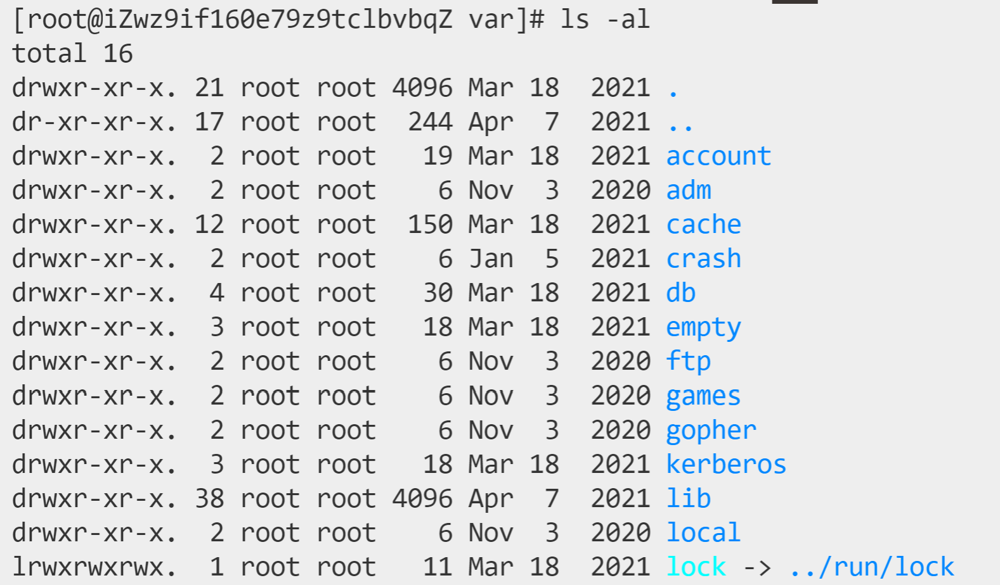

### 一、文件处理命令

#### 1.1 目录处理命令

- 命令名称：ls

- 英文原意：list

- 命令所在路径：/bin/ls

- 执行权限：所有用户

- 功能：显示目录文件

- 语法：ls [选项] [文件或目录]

- 用法：

  ```
  //显示所有文件（all），包括隐藏文件
  ls -a
  
  //详细信息（long，长格式信息）显示，如文件大小、最后一次修改日期、拥有修改权限的用户名等
  ls -l
  
  //查看目录属性
  ls -d
  
  //ls -a和ls -l简写
  ls -al
  
  //显示详细信息，同时考虑人性化（human，如让文件大小显示K、M等单位，而不是默认不显示的B）
  ls -lh
  
  //只查看该目录的详细信息，而不是该目录下的所有文件的详细信息
  ls -ld
  
  //查看根目录文件
  ls /
  
  //
  ls -i
  ```
  
  > 1、隐藏文件：设计初衷是告诉用户这是一个系统级文件，我们不要乱动它。特别的，不同于windows，Linux系统规定，以.开头的文件即被视为隐藏文件。换言之，如果想要让文件隐藏，只需要将其以.开头命名即可
  >
  > 2、Linux中，每个文件就把用户分成了三类：所有者（user，一个文件有且只有一个）、所属组（group，一个文件有且只有一组）、其它人（other）
  
- 示例：

  如图所示是ls -al的结果

  

  列表从左至右的含义是：

  - 综合特性描述：

    - 第一项：文件类型，如：二进制文件（-）、目录（d）和软链接文件（l），以及其它大多用不到的文件类型。

    - 后九项：

      | u（user） | g（group） | o（other） |
      | :-------: | :--------: | :--------: |
      |  所有者   |   所属组   |   其他人   |
      |    r读    |    w写     |   x执行    |

      ```
      //一个文件夹目录
      //文件权限：所有者-->读、写、执行；所属组-->读、执行；其他人-->读、执行
      drwxr-xr-x.
      ```

  - 引用计数：表示此文件曾经被调用或引用过多少次

  - 文件所有者

  - 文件所属组

  - 文件大小：默认单位字节

  - 文件最后一次修改时间

  - 文件名


#### 1.2 文件处理命令

#### 1.3 链接命令


### 二、权限管理命令


### 三、文件搜索命令


### 四、帮助命令


### 五、用户管理命令


### 六、压缩解压命令


### 七、网络命令


### 八、关机重启命令

